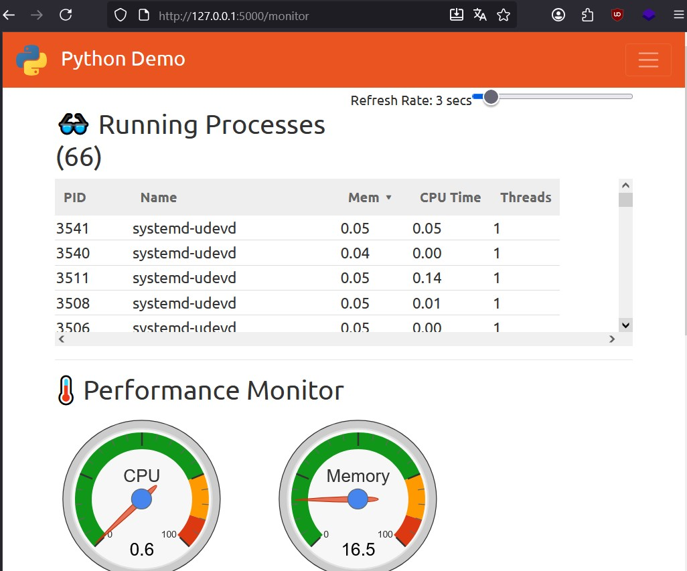
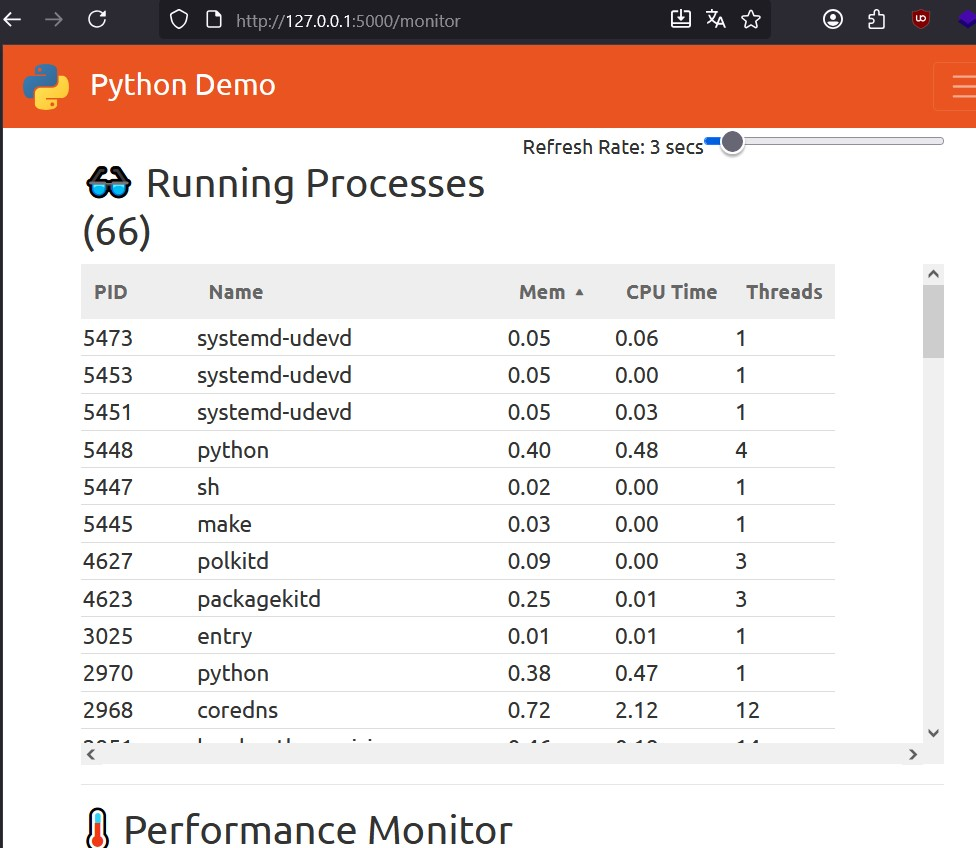
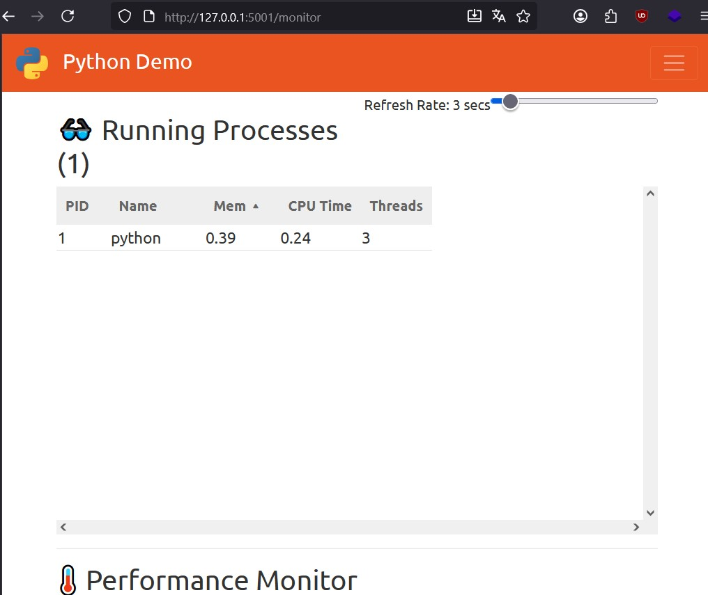
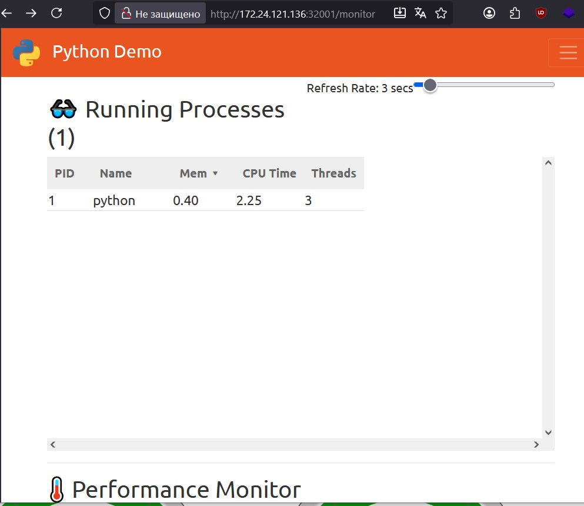
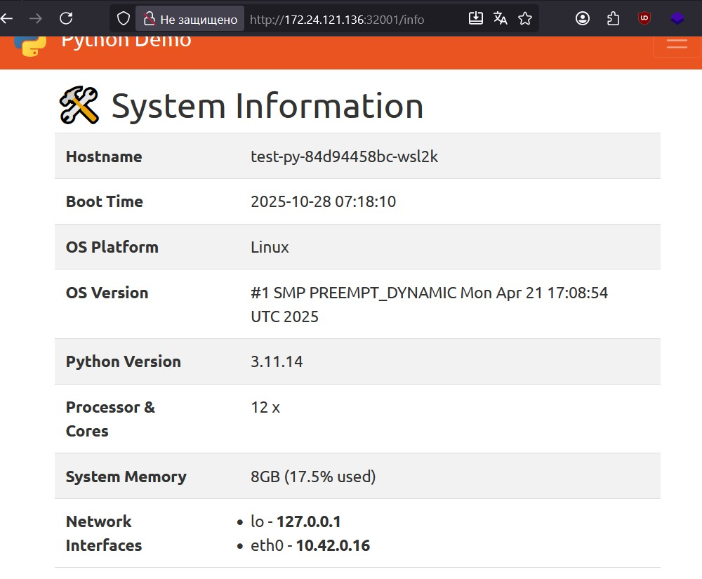

# Инструкция по выполнению тестового задания
Данная инструкция составлена при выполнении конкретного тестового задания и будет разбита на этапы выполнения согласно списку заданий. 

Все выполнялось на системе на базе ubuntu.

Контакты для связи: 
- bag234.work@gmail.com
- work@mrbag.org 

## Этап 1. Сборка Docker image, редактирование исходников REST-сервиса Python
В качестве основы для сборки были взяты исходники из следующего репозитория: https://github.com/benc-uk/python-demoapp

### Задача 1.1. Изменения html страницы REST-сервиса
Страница была изменена для увеличения размера блока вывода текущих значений запущенных процессов.

Первоначальный вид:


Измененный вид:

Внесенные изменения в файл разметки страницы `src/app/templates/monitor.html line:17`
Было:
``` html
<!-- line:17 --->
<div style="height: 200px; overflow: scroll">
<!-- ... --->
```
Стало:
```html
<!-- line:17 --->
<div style="height: 400px; overflow: scroll">
<!-- ... --->
```

__Примечание:__ Перед запуском был обновлен файл со зависимостями `src/requirements.txt`, для обеспечения запуска на новых версиях python.
Было:
``` txt
Flask==1.1.2
py-cpuinfo==7.0.0
psutil==5.8.0
gunicorn==20.1.0
black==20.8b1
flake8==3.9.0
pytest==6.2.2
```
Стало:
``` txt 
py-cpuinfo==7.0.0
psutil==5.8.0
gunicorn==20.1.0
black==20.8b1
flake8==3.9.0
pytest==6.2.2
Flask==2.3.3
Jinja2==3.1.2
```

### Задача 1.2. Создание dockerfile для сборки.
Для сборки данного проекта был выбран официальный образ python на базе alpine linux. Снизу приведён пример итоговый `dockerfile`:
``` dockerfile
# Официальный образ python based on alpine
FROM python:3.11-alpine
# Установка зависимостей для сборки
RUN apk update && apk add --no-cache build-base linux-headers pkgconfig && rm -rf /var/cache/apk/*
WORKDIR /app

COPY src/requirements.txt .
# Установка зависимостей проекта 
RUN pip install --no-cache-dir --upgrade pip && pip install --no-cache-dir -r requirements.txt \ 
&& apk del build-base linux-headers pkgconfig

COPY src/ .
#Запуск от имени другого пользователя
RUN adduser -D dockeruser
USER dockeruser
#Проброс порта
EXPOSE 5000

CMD ["python", "run.py"]
```
__Примечания:__ Для уменьшения размера образа образ собирается из исходников проекта напрямую не используя `makefile`. 

Ниже приведен пример запущенного сервиса через контейнер docker. Команда для запуска: 
``` sh
sudo docker run -ti --rm -p 5001:5000 testpy:beta
```
_Параметры_
`-ti` - подключения к выводу приложения в интерактивном режиме.
`--rm` - авто удаление контейнера.

Пример запущенного контейнера:


### Задача 1.3. Публикация контейнера Docker Hub
Контейнер был опубликован и доступен по следующему имени `mrbagef/testpy:[Version]`.
URL адрес: 
https://hub.docker.com/r/mrbagef/testpy

## Этап 2. Установка k3s
Для установки кластера k3s 
``` sh
curl -sfL https://get.k3s.io | sh -
```
В качестве архитектуры был выбран: кластер из одной ноды.

``` bash
$ root@host:~# kubectl get nodes
NAME              STATUS   ROLES                  AGE   VERSION
desktop-7dm51jo   Ready    control-plane,master   16h   v1.33.5+k3s1
```

## Этап 3. Создание namespace
Для создания namespace в kubernetis была вызвана следующая команда: 
``` sh
kubectl create ns maslak
```

_Список все текущих namespace:_
``` bash
$ root@host:~# kubectl get ns
NAME              STATUS   AGE
default           Active   16h
kube-node-lease   Active   16h
kube-public       Active   16h
kube-system       Active   16h
maslak            Active   16h
```

## Этап 4. Развертывание микросервиса
Для развертывания данного микросервиса нужно подготовить следующие манифесты:

### Задача 4.1. Deployment манифест.
Для запуска одной реплики, простого пода, доступ по порту 32001, был сформулированн следующий манифест `kube/deployment-limeted.yaml`: 
``` yaml
apiVersion: apps/v1
kind: Deployment
metadata:
  name: test-py
  namespace: maslak # нужный namespace
  labels:
    scope: test
    app: test-py # Тег для работы с selectors
spec:
  replicas: 1
  selector:
    matchLabels:
      app: test-py
  template:
    metadata:
      labels:
        app: test-py
    spec:
      restartPolicy: Always
      containers:
        - name: test-py
          image: mrbagef/testpy:alpha # Доступ ко repository
          ports:
            - containerPort: 5000
          resources: # Ограничение по ресурсам
            limits:
              memory: "256Mi"
              cpu: "500m"
            requests:
              memory: "128Mi"
              cpu: "250m"
          livenessProbe: # Проверка состояния процесса
            httpGet:
              path: /monitor
              port: 5000
            initialDelaySeconds: 30
            periodSeconds: 10
          readinessProbe: # Проверка Готовности 
            httpGet:
              path: /monitor
              port: 5000
            initialDelaySeconds: 3
            periodSeconds: 5

```

### Задача 4.2. Service манифест 
Для доступа к развернутому поду, был сформулирован манифест `kube/service.yaml`:

``` yaml 
apiVersion: v1
kind: Service
metadata:
  name: test-py
  namespace: maslak
  labels:
    scope: test
    app: test-py
spec:
  type: NodePort # Использования NodePort
  selector:
    app: test-py
  ports:
    - protocol: TCP
      port: 5000
      targetPort: 5000
      nodePort: 32001 # Порт для внешнего доступа

```
<br>

Комманды для запуска задач на выполнения (первый запуск):
``` sh
kubectl create -f kube/deployment.yaml
kubectl create -f kube/service.yaml

```
(обновление манифеста):
``` sh
kubectl apply -f kube/deployment.yaml
kubectl apply -f kube/service.yaml
```

## Задача 5. Проверка работоспособности
Для проверки работоспособности откроем свой браузер и введем следующий адрес: `http://host-ip:32001/monitor`. 
Пример изображения: 



## Задача 6. Размещение результатов
Все нужные файлы и инструкция для их использования представлены на данном репозитории.

---
# Последовательная сборка
Ниже будет приведено набор команд для выполнения сборки (пример):
```sh 

git clone https://github.com/benc-uk/python-demoapp.git
cd python-demoapp/
# Обновление файла зависимостей 
wget https://raw.githubusercontent.com/bag234/testpy-report/refs/heads/main/requirements.txt -O src/requirements.txt
# Получения dockerfile
wget https://raw.githubusercontent.com/bag234/testpy-report/refs/heads/main/dockerfile -O dockerfile

# Сборка контейнера 
docker build . -t mrbagef/testpy:latest
# Запуск в интерактивном режиме и доступе по порту 5001
docker run -ti --rm -p 5001:5000 mrbagef/testpy:latest

# Публикация образа
docker push mrbagef/testpy:latest

# ---
# Установка k3s  и запуск сервиса
curl -sfL https://get.k3s.io | sh -
# Добавление namespace
kubectl create ns maslak
# Получение и запуск deployment
wget https://raw.githubusercontent.com/bag234/testpy-report/refs/heads/main/kube/deployment-limeted.yaml -O deployment.yaml
kubectl create -f kube/deployment.yaml
# Получение и запуск service
wget https://raw.githubusercontent.com/bag234/testpy-report/refs/heads/main/kube/service.yaml -O service.yaml
kubectl create -f kube/service.yaml
# Проверка запуска  
kubectl get pods -n maslak
kubectl logs -n maslak deploy/test-py
```

## Пример CI/CD
Приведен простой пример организации CI/CD на базе Jenkins, описанный в файле `Jenkinsfile`.
```
pipeline {
    agent any

    environment {
        DOCKER_IMAGE = "mrbagef/testpy:latest"
        NAMESPACE = "maslak"
    }

    stages {

        stage('Clone original repo') {
            steps {
                git branch: 'master', url: 'git@github.com:benc-uk/python-demoapp.git' 
            }
        }

        stage('Update requirements & Dockerfile') {
            steps {
                sh 'wget https://raw.githubusercontent.com/bag234/testpy-report/refs/heads/main/requirements.txt -O src/requirements.txt'
                sh 'wget https://raw.githubusercontent.com/bag234/testpy-report/refs/heads/main/dockerfile -O dockerfile'
            }
        }

        stage('Build Docker image and publish to Docker Hub') {
            steps {
                def app = docker.build("${DOCKER_IMAGE}")
                docker.withRegistry('', 'docker-hub-credentials') {
                    app.push()
                }
            }
        }

        stage('Create namespace if not exists') {
            steps {
                sh 'kubectl get ns ${NAMESPACE} || kubectl create ns ${NAMESPACE}'
            }
        }

        stage('Deploy to k3s') {
            steps {
                sh 'wget https://raw.githubusercontent.com/bag234/testpy-report/refs/heads/main/kube/deployment-limeted.yaml -O deployment.yaml'
                sh 'kubectl apply -f deployment.yaml -n ${NAMESPACE}'

                sh 'wget https://raw.githubusercontent.com/bag234/testpy-report/refs/heads/main/kube/service.yaml -O service.yaml'
                sh 'kubectl apply -f service.yaml -n ${NAMESPACE}'
            }
        }
    }
}
```

# Nginx конфигурация
Файл `nginx.conf` содержит настройки для доступа через Nginx.